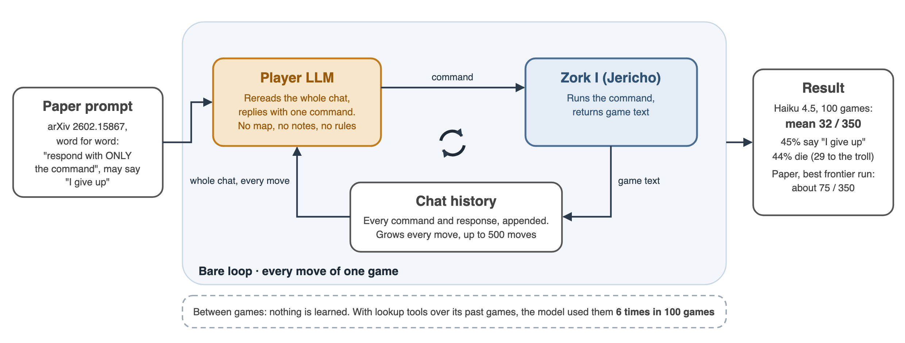
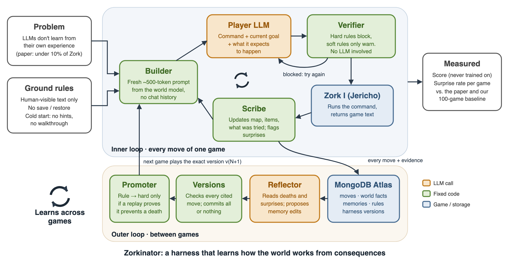

<div align="center">

# Zorkinator

**A self-improving agent harness that learns how a world works from what happens to it.**

It plays *Zork I* using only what a human player can see, turns each game's consequences into versioned,
evidence-backed memory in MongoDB Atlas, and lets a belief block an action only after a replay proves it
would have prevented a death.


</div>

---

## The problem

LLM agents do not learn from their own experience on long, unfamiliar tasks.

In *Playing With AI* ([arXiv 2602.15867](https://arxiv.org/abs/2602.15867)), frontier models played Zork I in a
bare loop and completed under 10% of it on average; the best run reached about 75 of 350 points. The models
"failed to learn from previous attempts despite access to conversation history."

We reproduced that failure. Given the paper's prompt plus tools to look up its own past games (the way the
chat apps let those models see earlier chats), Claude Haiku 4.5 looked something up **6 times in 100 games**,
and its score did not improve. Raw memory is not enough. The experience has to be turned into knowledge the
agent can actually use, and the agent must not be allowed to act on beliefs it cannot back up.

<p align="center">
  
  <br><em>Before: the paper's bare loop. Nothing is learned between games.</em>
</p>

## What makes it different

| Typical self-improving harness | Zorkinator |
|---|---|
| Learns from a **reward**: compares winning and losing runs and rewrites the prompt | Learns from **consequences**: "went down with no light → eaten by a grue". The score is measured, never trained on. |
| What it learns is a new prompt | What it learns is **versioned memory**: every belief cites the move that produced it, and every game plays one exact, immutable harness version, so game 1 and game N can be compared directly |
| An LLM critic (or nothing) decides what is allowed | **Blocking is earned.** Memories only advise. A rule may block a command only after a mechanical replay shows it would have prevented a death and never blocked progress, and the harness cannot edit its own verifier |
| Reports a score | Reports the score **and a surprise rate** (being added): the agent predicts each outcome, and wrong predictions show exactly where its picture of the world was wrong |
| Often has privileged state (valid-action lists, save/restore, object trees) | Uses **only human-visible information**: game text and the status line. No save/restore, no walkthrough, no valid-action list |

## How it works

<p align="center">
  
  <br><em>After: Zorkinator. The inner loop plays each move; the outer loop turns each game into the next harness version.</em>
</p>

1. **Inner loop, one move.** The scribe updates the game's working knowledge (rooms, exits, items, what was
   tried and what happened). The builder writes a fresh, compact prompt from it, with no chat history. The player
   replies with a command and its current goal; a predicted outcome is being added. The verifier will check the
   command against learned rules before it reaches the game.
2. **Outer loop, after each game.** The reflector reads the finished game (deaths and score changes first) and
   proposes memory changes: add, revise, or retire. The version manager checks every cited move exists, then
   commits the whole batch or none of it, and publishes a new harness version. The next game plays exactly that
   version.
3. **Earned authority.** A proposed rule starts soft: it only adds a warning. The promoter makes it hard only if
   replaying the logged games shows it matches a move that ended in death, and matches no survived move that
   was followed by points later in the game. There is no LLM in that check.

## Status

| Piece | State |
|---|---|
| Paper baseline, past-chat condition, chains, analysis | Working; 100+ games logged |
| Inner loop: world model, builder, player with goal, stall monitor | Working |
| Outer loop: reflector, immutable versions, sequential chain on Atlas | Working; two-game smoke chain passed |
| Verifier `check` and replay promoter (`verifier.py`) | Built and tested; not yet wired into the chain, which currently keeps every rule soft |
| Predicted outcomes and surprise rate | Designed (`docs/DECISIONS.md`); fields exist, not yet in the player |
| GRUE LAB dashboard | Working on mock data; moving to live Atlas data |

## Results so far

Baseline, the paper's loop with Claude Haiku 4.5, seed 0, 500-move cap (full numbers in
[`docs/RESULTS.md`](docs/RESULTS.md)):

| Condition | Games | Mean | Median | Max |
|---|---|---|---|---|
| Paper loop + past-chat lookup tools, 10 chains × 10 games | 100 | 32.0 | 34 | 59 |
| Paper loop + past-chat lookup tools, one long chain | 25 (running) | ~40 | 44 | 49 |
| Paper loop, Claude Opus 4.5 (single game) | 1 | 44 | | |

- The model almost never used its past games (6 lookups in 100 games).
- 45% of games ended with "I give up"; of 44 deaths, 29 were to the troll.
- Two identical baseline setups differed by about 8 points, so a harness gain has to clear the higher baseline
  to count.

The versioned harness chain runs end to end on Atlas (a two-game smoke chain passed). Full harness results
will be added here.

## Quickstart

### Setup

On macOS or Linux, the setup script installs a project-local Python 3.11 runtime with `uv`, all runtime and
development dependencies, the spaCy model, the verified Zork I story file, and the Git hooks:

```bash
./setup.sh
```

Manual setup, if preferred:

```bash
brew install python@3.11            # Jericho does not build on 3.14
python3.11 -m venv .venv && source .venv/bin/activate
pip install -r requirements.txt
python -m spacy download en_core_web_sm

mkdir -p games
curl -L -o games/zork1.z5 https://github.com/BYU-PCCL/z-machine-games/raw/master/jericho-game-suite/zork1.z5
md5 games/zork1.z5                  # b732a93a6244ddd92a9b9a3e3a46c687

cp .env.example .env                # then fill in keys
```

`.env` needs `ANTHROPIC_API_KEY` and `MONGODB_URI`. For development and smoke tests you can also set
`OPENAI_API_KEY` and optionally `OPENAI_TEST_MODEL` (default: `gpt-5.6-luna`). Keep credentials only in `.env`;
never commit or print them. The recorded benchmark model is separate: see [`docs/DECISIONS.md`](docs/DECISIONS.md).

### Run

```bash
# Play Zork yourself (SAVE, RESTORE and RESTART are blocked)
python -m zorkinator manual --seed 0

# Paper baseline: one game, or chains of games with past-chat lookup tools
python -m zorkinator baseline
python -m zorkinator baseline --chains 10 --games 10 --chats chats/haiku-memory --total-usd-cap 120

# Harness: a sequential, versioned chain on Atlas (resumes by chain name)
python -m zorkinator harness --chain demo-01 --games 10 --moves 500

# Results tables and a significance test between two conditions
python -m zorkinator.analyze --compare chats long
```

### Dashboard (GRUE LAB)

```bash
uvicorn zorkinator.view.app:app --reload --port 8000        # API over Atlas
cd frontend && npm i && VITE_USE_MOCK=false npm run dev     # UI; omit VITE_USE_MOCK for mock data
```

## Architecture

| Module | Role |
|---|---|
| `adapter.py` | Jericho wrapper; blocks `save`/`restore`/`restart` |
| `runner.py`, `prompts.py`, `memory.py` | The paper's baseline loop, its verbatim prompts, and the past-chat lookup condition |
| `world.py`, `scribe.py` | Per-game working knowledge: map, items, objectives, what was tried |
| `builder.py`, `player.py`, `monitor.py` | Fresh prompt each move; one command plus goal; repetition and stall warnings |
| `harness.py`, `driver.py` | One harness game; the sequential chain that plays, reflects, and commits versions |
| `reflector.py`, `versions.py` | Proposes memory changes from evidence; validates and publishes immutable versions |
| `verifier.py` | Mechanical rule checks and soft → hard promotion by replay |
| `db.py` | The only module that talks to MongoDB Atlas, including Vector Search recall |
| `analyze.py` | Results tables, surprise rate, permutation tests |
| `view/`, `frontend/` | FastAPI over Atlas and the GRUE LAB dashboard |

### Ground rules

- **Human-visible information only.** The model never sees Jericho's valid-action list, object tree, RAM, or
  the walkthrough.
- **No save, restore, or restart.** Death ends the game.
- **Cold start.** Every experiment starts from an empty version: no hand-written rules, hints, or lessons.
- **Same model** for every call in a comparison, and the **same seed** for the games being compared.
- **Fixed constitution.** The verifier, the promotion procedure, scoring, and budgets are code the harness
  cannot change.

## Development

Run the same checks used by CI:

```bash
ruff check .
ruff format --check .
mypy
python -m unittest discover -v
```

Pre-commit runs Ruff (including formatting) and strict mypy with the Pydantic plugin. GitHub Actions runs the
checks again on every push and pull request. Configure the repository's branch protection to require the
`lint-type-test` check if merges must be blocked when these checks fail.

Jericho does not ship type information, so its supported API surface is defined in
`typings/jericho/__init__.pyi`. Update that stub in the same change whenever new Jericho APIs are used; strict
mypy deliberately does not ignore missing imports globally.

## Docs

Coding agents: start at [`AGENTS.md`](AGENTS.md).

- [`docs/CONTRACTS.md`](docs/CONTRACTS.md): Mongo shapes and function signatures (authority)
- [`docs/DECISIONS.md`](docs/DECISIONS.md): what's decided and what's still proposed
- [`docs/INNER_LOOP.md`](docs/INNER_LOOP.md) · [`docs/OUTER_LOOP_MEMORY.md`](docs/OUTER_LOOP_MEMORY.md): the two loops
- [`docs/INTEGRATION_HANDOFF.md`](docs/INTEGRATION_HANDOFF.md): how the loops connect
- [`docs/PAPER_BASELINE.md`](docs/PAPER_BASELINE.md) · [`docs/RESULTS.md`](docs/RESULTS.md): baseline protocol and results
- [`docs/ARCHITECTURE_MAP.md`](docs/ARCHITECTURE_MAP.md) · [`docs/DESIGN.md`](docs/DESIGN.md): original design
- [`docs/PRIOR_ART.md`](docs/PRIOR_ART.md): ZorkGPT and jev-zork, and what we learned from them

## Prior art and credits

- Berry Gerrits, *Playing With AI: How Do State-Of-The-Art Large Language Models Perform in the 1977
  Text-Based Adventure Game Zork?* ([arXiv 2602.15867](https://arxiv.org/abs/2602.15867)): the baseline and
  prompts we reproduce.
- [Jericho](https://github.com/microsoft/jericho) (Microsoft) and the
  [z-machine-games](https://github.com/BYU-PCCL/z-machine-games) story files.
- [ZorkGPT](https://github.com/stickystyle/ZorkGPT): its own analysis found its LLM critic wrong in 68 of 77
  overridden rejections, which is why our verifier is mechanical.
- [jev-zork](https://github.com/Resadan-dev/jev-zork) and
  [Strands Harness Optimizer](https://github.com/strands-labs/harness-optimizer): contrast points for
  learning without cross-game memory and for reward-driven prompt optimization.

Built in one day at the MongoDB × Cerebral Valley Harness Engineering & Model Wrangling Hackathon, New York,
September 26, 2026, by Josh Huang, Himali Saini, Elliott Kalt, and Seb.
